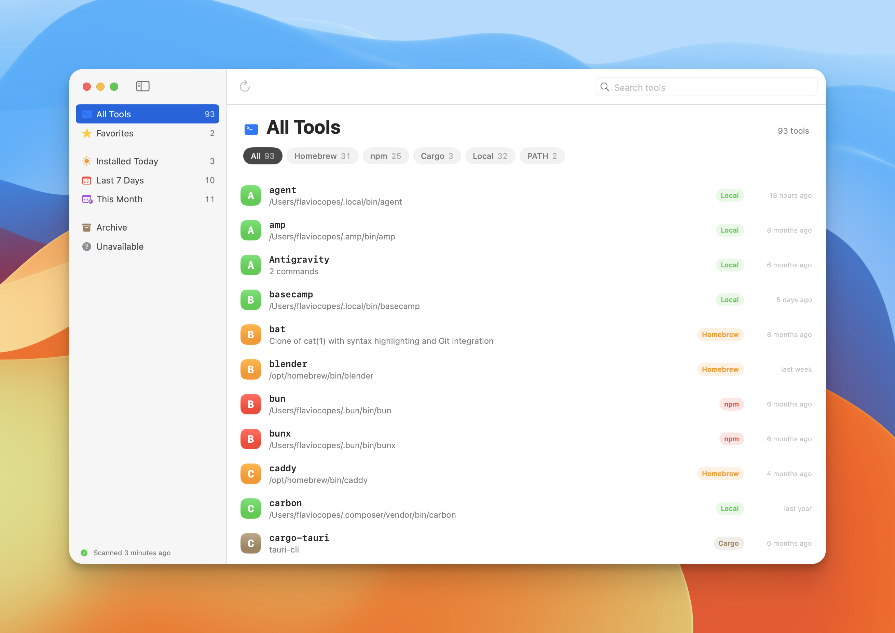
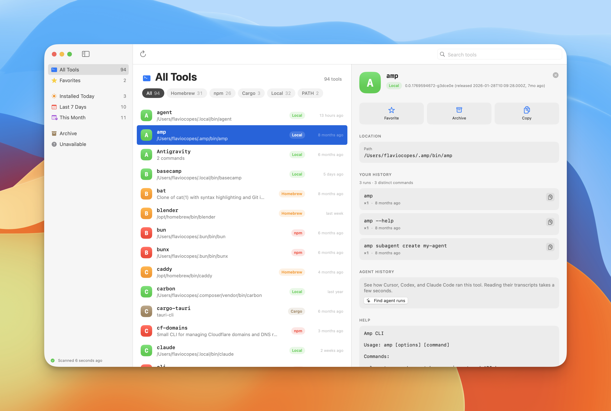
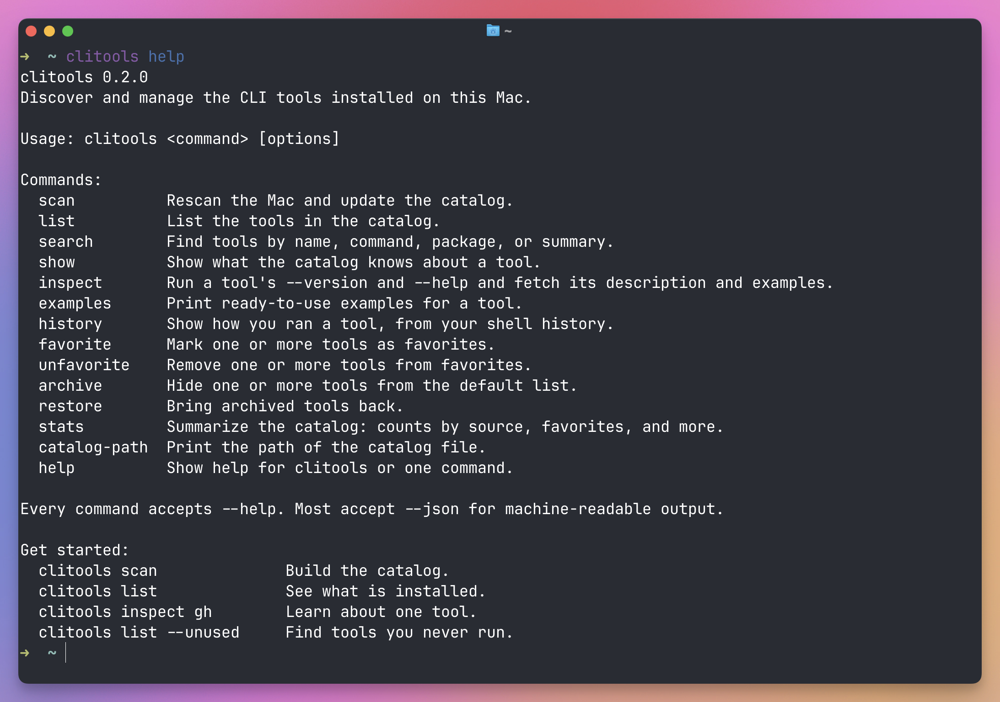

# CLI Tools

CLI Tools gives you one catalog for every command-line tool on your Mac.

The native app finds packages you explicitly installed with Homebrew, npm, and Cargo. It also scans trusted user command directories. Package commands stay grouped, so one package does not flood the catalog with helper executables.

The companion CLI reads the same catalog. AI agents can use its JSON output to discover the tools available on your system.



## Requirements

- macOS 14 or later
- Xcode 26 or a Swift 6.2 toolchain

## Run the app

Build the macOS app bundle:

```bash
./Scripts/build-app.sh
```

Then open it:

```bash
open "dist/CLI Tools.app"
```

You can also run the development build:

```bash
swift run CliToolsApp
```

## See who runs your tools

Select a tool and the detail pane shows two kinds of history.



**Your History** comes from your shell history (zsh, bash, and fish). It loads with the catalog and groups the commands that ran the tool, most recent first, with a run count and the last time you used it.

**Agent History** covers the commands that AI agents ran. Agents never touch your shell history. They run each command in their own process. But Cursor, Codex, and Claude Code all keep a session transcript on disk, and every shell call is recorded there:

| Agent | Transcripts |
|---|---|
| Cursor | `~/.cursor/projects/*/agent-transcripts/` |
| Codex | `~/.codex/sessions/` |
| Claude Code | `~/.claude/projects/` |

These transcripts add up to gigabytes, so the app does not read them on its own. Click **Find agent runs** in the detail pane when you want to know. The scan takes a few seconds, then stays in memory while the app is open, so the section fills in instantly for every other tool you select. Each command shows which agents ran it. Click **Refresh** to pick up sessions that finished since.

Nothing from either history is written to the catalog.

A few things to know:

- The transcript formats are undocumented and change between agent releases. The parsers skip anything they do not recognize, so a format change shows up as missing runs, never as a crash.
- Cursor does not timestamp individual tool calls. Those runs are dated by the chat turn that triggered them.
- Codex has renamed its shell tool over time. `shell`, `shell_command`, and `exec_command` are all covered. Commands embedded in its newer JavaScript tool are not.

## Use the CLI



Install the `clitools` command:

```bash
./Scripts/install-cli.sh
```

This builds the release binary and symlinks it into `~/.local/bin`. Pass a different directory to install somewhere else, for example `./Scripts/install-cli.sh /opt/homebrew/bin`. Without installing, run the same commands with `swift run clitools` instead of `clitools`.

Scan your Mac:

```bash
clitools scan
```

The scan tells you how many tools it found per source, and which ones appeared or disappeared since the last scan.

List what is installed:

```bash
clitools list
clitools list --favorites
clitools list --source homebrew
clitools list --sort usage
clitools list --unused
clitools list --json
```

Every list shows the star, name, source, version, and description. `--sort usage` orders by how often you ran each tool, from your shell history. `--unused` shows tools that never appear in it, handy when cleaning up.

Find a tool by name, command, package, or description:

```bash
clitools search markdown
```

Learn about a tool:

```bash
clitools show gh
clitools inspect gh
clitools examples gh
```

`show` prints what the catalog already knows. `inspect` runs the tool with `--version` and `--help`, and fetches its description, homepage, and examples. Homebrew tools get their official description. Examples come from the tool's [tldr page](https://github.com/tldr-pages/tldr) and from the examples section of its help output. Inspection only happens when you ask for it, never during a scan.

Tools can be found by any of their commands. `clitools show psql` finds the PostgreSQL package. Typos get a "did you mean" hint.

Manage tools, one or many at a time:

```bash
clitools favorite gh bat
clitools archive vercel
clitools restore vercel
```

See how you used a tool:

```bash
clitools history gh
clitools history gh --limit 10
```

This reads your shell history (zsh, bash, and fish) and groups the commands that ran the tool. Nothing from your history is written to the catalog.

See how AI agents used it instead:

```bash
clitools history gh --agents
```

This reads the Cursor, Codex, and Claude Code transcripts described in [See who runs your tools](#see-who-runs-your-tools). It takes a few seconds and adds an agent column to the output.

Get a summary of the catalog:

```bash
clitools stats
```

Every command accepts `--help`, and most accept `--json`. Hints and footers only show up in a terminal, so piped output stays clean.

## Catalog location

The app and CLI share this file:

```text
~/Library/Application Support/CliTools/catalog.json
```

Print its path from the CLI:

```bash
clitools catalog-path
```

## Run the tests

```bash
swift test
```

## Contributing

Issues and pull requests are welcome. Run `swift test` before opening a PR.

Working with an AI coding agent? Point it at [AGENTS.md](AGENTS.md). It has the build commands, the project layout, and the rules to follow.

## License

[MIT](LICENSE)
